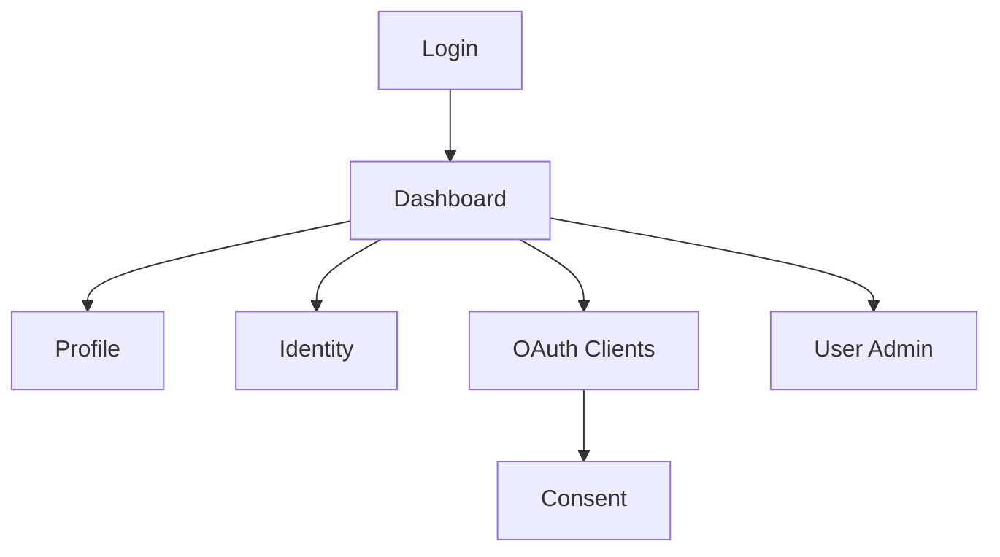
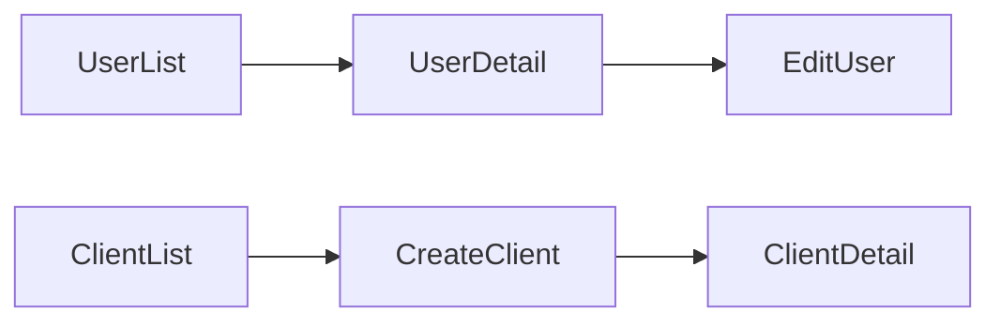
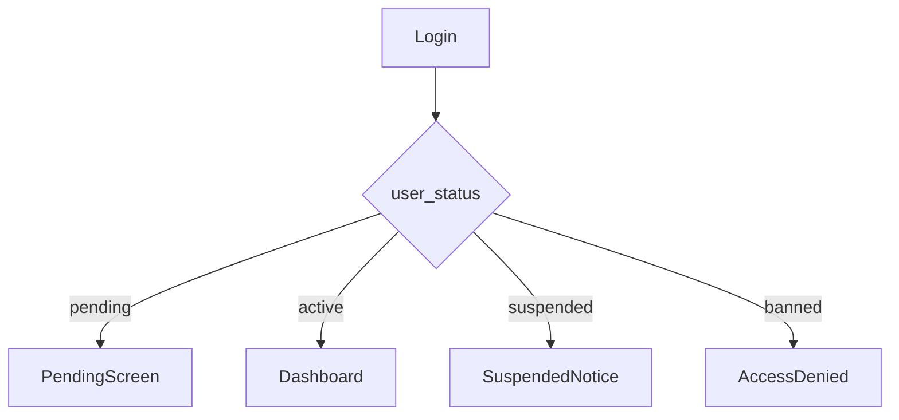
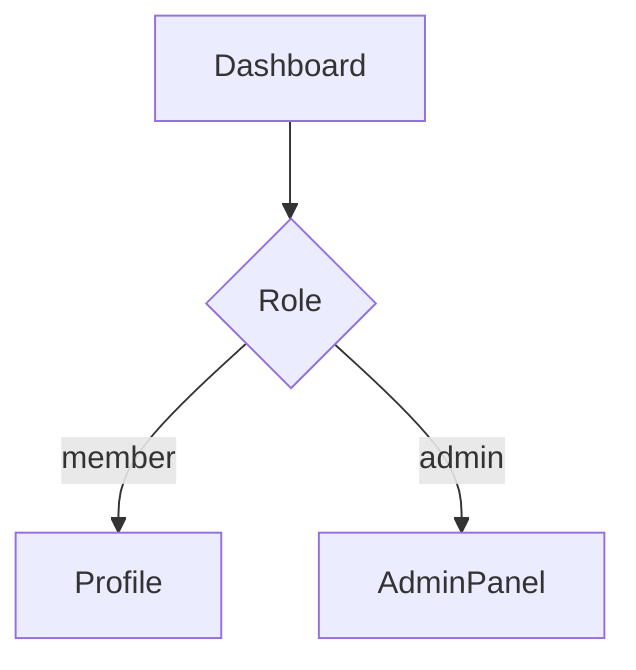
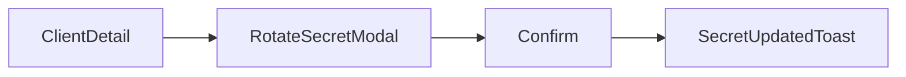
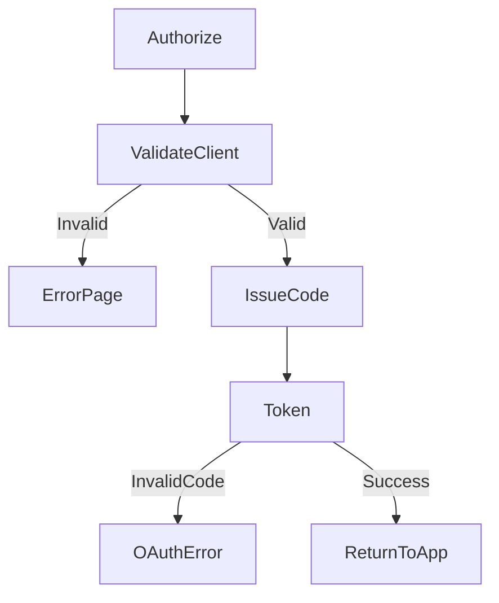
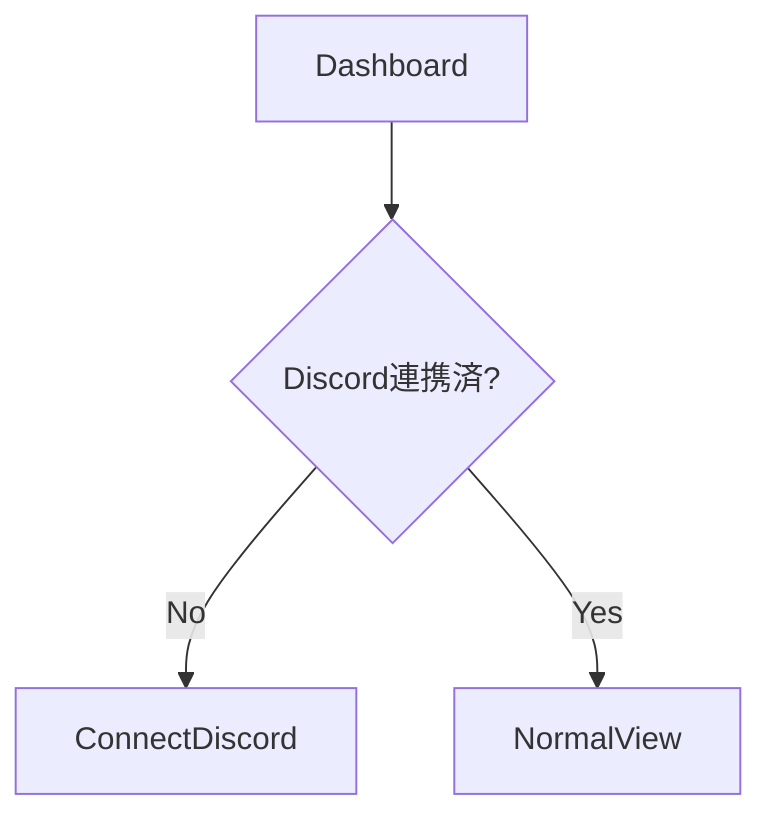

# 🖥️ screen-flow.md テンプレート

---

# 0️⃣ 設計前提

| 項目     | 内容                             |
| ------ | ------------------------------ |
| 対象ユーザー | 未ログイン / 部員（member）/ 管理者（admin） |
| デバイス   | Desktop中心（管理UI前提）/ Responsive  |
| 認証要否   | 基本全面認証制（/loginのみ公開）            |
| 権限制御   | RBAC（admin / member）           |
| MVP範囲  | P0画面のみ（OIDC成立に必要なUI）           |

---

# 1️⃣ 画面一覧（Screen Inventory）

| ID   | 画面名        | 役割             | 認証  | 優先度 |
| ---- | ---------- | -------------- | --- | --- |
| S-01 | ログイン選択     | Discordログイン入口  | 不要  | P0  |
| S-02 | 認可確認画面     | OAuthスコープ同意    | 必須  | P0  |
| S-03 | ダッシュボード    | ユーザー中心画面       | 必須  | P0  |
| S-04 | プロフィール     | 自分の情報確認        | 必須  | P0  |
| S-05 | Identity管理 | 外部連携確認         | 必須  | P1  |
| S-06 | クライアント管理   | OAuthアプリ登録     | 管理者 | P0  |
| S-07 | ユーザー管理     | 部員管理           | 管理者 | P1  |
| S-08 | ロール管理      | admin/member制御 | 管理者 | P1  |
| S-09 | 監査ログ       | ログイン履歴確認       | 管理者 | P2  |

---

# 2️⃣ 全体遷移図（高レベル）



---

# 3️⃣ 認証フロー

```mermaid
flowchart LR
    App[部内アプリ]
    Authorize[/authorize]
    Login[Login]
    Consent[Consent]
    Token[/token]
    AppHome[アプリ画面]

    App --> Authorize
    Authorize --> Login
    Login --> Consent
    Consent --> Token
    Token --> AppHome
```

---

# 4️⃣ CRUD標準遷移テンプレ



---

# 5️⃣ 状態別分岐（State-based Flow）



---

# 6️⃣ 権限別分岐（RBAC/ABAC）



---

# 7️⃣ モーダル・非同期操作



---

# 8️⃣ エラーフロー



---

# 9️⃣ 空状態 / 初回体験



---

# 🔟 モバイル考慮（任意）

| 項目      | Desktop | Mobile     |
| ------- | ------- | ---------- |
| ナビゲーション  | Sidebar  | Drawer |
| クライアント管理 | テーブル表示   | 縦カード   |
| 認可画面     | 詳細スコープ表示 | 簡易表示   |


---

# 12️⃣ URL設計テンプレ（OAuth）

```
/login
/dashboard
/profile
/identities
/admin/users
/admin/clients
/admin/roles

/oauth/authorize
/oauth/token
/oauth/consent
/.well-known/openid-configuration
/.well-known/jwks.json
```
