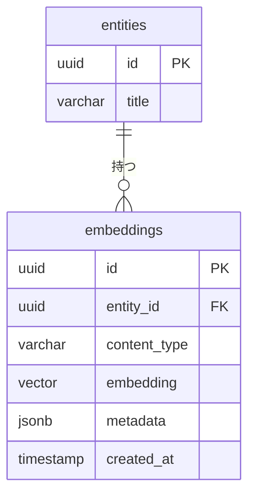
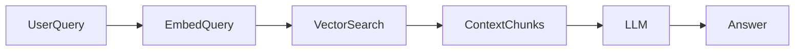

# 🗄️ DB設計書テンプレート

---

# 0️⃣ 設計観点

| 項目    | 内容                                           |
| ----- | -------------------------------------------- |
| 権限モデル | RBAC（admin/member）+ OAuth Scope（API制御）       |
| ID戦略  | 内部: BIGINT IDENTITY / 外部公開: UUID（users.uuid） |
| 論理削除  | 有（deleted_at）                                |
| 監査ログ  | 必須（監査 + 認可イベント）                              |

---

# 1️⃣ テーブル一覧テンプレート

| ドメイン  | テーブル名             | 役割     | Phase |
| ----- | ----------------- | ------ | ----- |
| アカウント  | users                      | 部内ユーザー主体              | P0    |
| 外部ID   | identities                 | Discord/GitHub等の紐付け   | P0    |
| 認可     | roles                      | ロール定義                 | P0    |
| 認可     | user_roles                 | ロール付与                 | P0    |
| OAuth  | oauth_clients              | 部内アプリ登録               | P0    |
| OAuth  | oauth_client_redirect_uris | リダイレクトURI管理           | P0    |
| OAuth  | oauth_authorization_codes  | 認可コード（PKCE）           | P0    |
| OAuth  | oauth_refresh_tokens       | Refresh Token（ハッシュ保存） | P0    |
| 公開鍵    | signing_keys               | JWKS用鍵管理（ローテ用）        | P1    |
| 監査     | audit_logs                 | 監査ログ（管理操作/重要イベント）     | P0    |
| セキュリティ | auth_events                | ログイン/トークン発行イベント       | P1    |
| 拡張     | oauth_scopes               | スコープ定義（任意）            | P1    |
| 拡張     | oauth_client_scopes        | クライアント許可スコープ          | P1    |


---

# 2️⃣ ERD（OIDC/OAuth）

```mermaid
erDiagram
    users {
        bigint id PK
        uuid uuid UNIQUE
        user_status status
        timestamptz created_at
        timestamptz updated_at
        timestamptz deleted_at
    }

    identities {
        bigint id PK
        bigint user_id FK
        varchar provider
        varchar provider_user_id
        jsonb profile
        timestamptz created_at
        timestamptz updated_at
        timestamptz deleted_at
    }

    roles {
        smallint id PK
        varchar name UNIQUE
        smallint level
        timestamptz created_at
    }

    user_roles {
        bigint user_id FK
        smallint role_id FK
        timestamptz granted_at
        bigint granted_by FK
    }

    oauth_clients {
        bigint id PK
        uuid client_id UNIQUE
        varchar name
        varchar client_type
        varchar secret_hash
        boolean is_confidential
        timestamptz created_at
        timestamptz updated_at
        timestamptz deleted_at
        bigint created_by FK
    }

    oauth_client_redirect_uris {
        bigint id PK
        bigint client_pk FK
        text redirect_uri
        timestamptz created_at
    }

    oauth_authorization_codes {
        bigint id PK
        uuid code_id UNIQUE
        bigint client_pk FK
        bigint user_id FK
        text redirect_uri
        text code_challenge
        varchar code_challenge_method
        text nonce
        text scope
        timestamptz expires_at
        timestamptz consumed_at
        timestamptz created_at
    }

    oauth_refresh_tokens {
        bigint id PK
        bigint client_pk FK
        bigint user_id FK
        varchar token_hash UNIQUE
        text scope
        timestamptz expires_at
        timestamptz revoked_at
        timestamptz created_at
        bigint parent_id FK
    }

    audit_logs {
        bigint id PK
        bigint actor_user_id FK
        varchar action
        varchar resource_type
        varchar resource_id
        jsonb meta
        inet ip
        text user_agent
        timestamptz created_at
    }

    signing_keys {
        bigint id PK
        varchar kid UNIQUE
        text public_jwk
        text private_key_ref
        boolean is_active
        timestamptz created_at
        timestamptz rotated_at
    }

    users ||--o{ identities : has
    users ||--o{ user_roles : has
    roles ||--o{ user_roles : grants
    users ||--o{ oauth_authorization_codes : issues
    oauth_clients ||--o{ oauth_authorization_codes : requests
    oauth_clients ||--o{ oauth_client_redirect_uris : allows
    users ||--o{ oauth_refresh_tokens : has
    oauth_clients ||--o{ oauth_refresh_tokens : has
    users ||--o{ audit_logs : acts
```

---

# 3️⃣ カラム定義テンプレート

## users

| カラム        | 型           | 制約              | 説明                              |
| ---------- | ----------- | --------------- | ------------------------------- |
| id         | BIGINT      | PK              | 内部ID                            |
| uuid       | UUID        | UNIQUE NOT NULL | 外部公開ID（OIDC sub）                |
| status     | user_status | NOT NULL        | pending/active/suspended/banned |
| created_at | TIMESTAMPTZ | NOT NULL        |                                 |
| updated_at | TIMESTAMPTZ | NOT NULL        | trigger更新                       |
| deleted_at | TIMESTAMPTZ | NULL            | 論理削除                            |


---

## identities（外部ID紐付け）

| カラム              | 型           | 制約          | 説明                    |
| ---------------- | ----------- | ----------- | --------------------- |
| id               | BIGINT      | PK          |                       |
| user_id          | BIGINT      | FK NOT NULL | users.id              |
| provider         | VARCHAR     | NOT NULL    | discord/github/google |
| provider_user_id | VARCHAR     | NOT NULL    | Discord user id等      |
| profile          | JSONB       |             | 表示名/アイコン等キャッシュ        |
| created_at       | TIMESTAMPTZ | NOT NULL    |                       |
| updated_at       | TIMESTAMPTZ | NOT NULL    | trigger更新             |
| deleted_at       | TIMESTAMPTZ | NULL        |                       |


---

## roles / user_roles（RBAC）

### roles

| カラム        | 型           | 制約              | 説明           |
| ---------- | ----------- | --------------- | ------------ |
| id         | SMALLINT    | PK              |              |
| name       | VARCHAR     | UNIQUE NOT NULL | ADMIN/MEMBER |
| level      | SMALLINT    | NOT NULL        | 80/50など      |
| created_at | TIMESTAMPTZ | NOT NULL        |              |

### user_roles

| カラム        | 型           | 制約          | 説明  |
| ---------- | ----------- | ----------- | --- |
| user_id    | BIGINT      | FK NOT NULL |     |
| role_id    | SMALLINT    | FK NOT NULL |     |
| granted_at | TIMESTAMPTZ | NOT NULL    |     |
| granted_by | BIGINT      | FK          | 付与者 |

- PRIMARY KEY(user_id, role_id)

---

## oauth_clients（部内アプリ登録）

| カラム             | 型           | 制約              | 説明                  |
| --------------- | ----------- | --------------- | ------------------- |
| id              | BIGINT      | PK              |                     |
| client_id       | UUID        | UNIQUE NOT NULL | 公開client_id         |
| name            | VARCHAR     | NOT NULL        | 表示名                 |
| client_type     | VARCHAR     | NOT NULL        | public/confidential |
| secret_hash     | VARCHAR     |                 | confidentialのみ      |
| is_confidential | BOOLEAN     | NOT NULL        |                     |
| created_by      | BIGINT      | FK              |                     |
| created_at      | TIMESTAMPTZ | NOT NULL        |                     |
| updated_at      | TIMESTAMPTZ | NOT NULL        |                     |
| deleted_at      | TIMESTAMPTZ | NULL            |                     |

## oauth_client_redirect_uris

| カラム          | 型           | 制約          | 説明               |
| ------------ | ----------- | ----------- | ---------------- |
| id           | BIGINT      | PK          |                  |
| client_pk    | BIGINT      | FK NOT NULL | oauth_clients.id |
| redirect_uri | TEXT        | NOT NULL    | 完全一致チェック用        |
| created_at   | TIMESTAMPTZ | NOT NULL    |                  |

- UNIQUE(client_pk, redirect_uri)

## oauth_authorization_codes（PKCE + nonce）

| カラム                   | 型           | 制約              | 説明            |
| --------------------- | ----------- | --------------- | ------------- |
| id                    | BIGINT      | PK              |               |
| code_id               | UUID        | UNIQUE NOT NULL | 認可コード識別子（DB側） |
| client_pk             | BIGINT      | FK NOT NULL     |               |
| user_id               | BIGINT      | FK NOT NULL     |               |
| redirect_uri          | TEXT        | NOT NULL        |               |
| code_challenge        | TEXT        | NOT NULL        | PKCE          |
| code_challenge_method | VARCHAR     | NOT NULL        | S256推奨        |
| nonce                 | TEXT        |                 | ID Token用     |
| scope                 | TEXT        | NOT NULL        | スペース区切り       |
| expires_at            | TIMESTAMPTZ | NOT NULL        | 短命            |
| consumed_at           | TIMESTAMPTZ |                 | 使い捨て          |
| created_at            | TIMESTAMPTZ | NOT NULL        |               |

## oauth_refresh_tokens（ハッシュ保存 + ローテ）

| カラム        | 型           | 制約              | 説明          |
| ---------- | ----------- | --------------- | ----------- |
| id         | BIGINT      | PK              |             |
| client_pk  | BIGINT      | FK NOT NULL     |             |
| user_id    | BIGINT      | FK NOT NULL     |             |
| token_hash | VARCHAR     | UNIQUE NOT NULL | 生トークンは保存しない |
| scope      | TEXT        | NOT NULL        |             |
| expires_at | TIMESTAMPTZ | NOT NULL        |             |
| revoked_at | TIMESTAMPTZ |                 |             |
| parent_id  | BIGINT      | FK              | ローテ元        |
| created_at | TIMESTAMPTZ | NOT NULL        |             |

## audit_logs（監査ログ）

| カラム           | 型           | 制約       | 説明                   |
| ------------- | ----------- | -------- | -------------------- |
| id            | BIGINT      | PK       |                      |
| actor_user_id | BIGINT      | FK       | 操作者                  |
| action        | VARCHAR     | NOT NULL | user.status_change等  |
| resource_type | VARCHAR     | NOT NULL | users/oauth_clients… |
| resource_id   | VARCHAR     | NOT NULL | 文字列で統一（uuid等も入る）     |
| meta          | JSONB       |          | 差分や理由                |
| ip            | INET        |          |                      |
| user_agent    | TEXT        |          |                      |
| created_at    | TIMESTAMPTZ | NOT NULL |                      |

# 4️⃣ 権限設計（DB連携）

## RBAC

- roles.level or roles.name で判定
- user_roles による付与

## ABAC（任意）

- まずは導入しない（複雑化するため）
- 必要になったら policies / policy_logs を追加

# 🧠 ベクトルDB設計テンプレート（統合拡張・任意）

OAuth基盤自体には必須ではないが、以下用途がある場合に有効：

- 監査ログ検索（自然言語で「怪しい操作」検索）
- ドキュメント/RAG（部内規約・運用手順の検索）

## アーキテクチャ選択パターン

## A. 同一DB内（pgvector）

```
App
 └── PostgreSQL (RDB + Vector)
```

**メリット**

- 監査ログの検索/分類に向く
- 運用が単純

**デメリット**

* 大規模時のスケール制限

---

## 外部ベクトルDB分離

```
App
 ├── RDB（メタデータ）
 └── Vector DB（検索専用）
```

**メリット**

- 大規模/高頻度検索向け
- 整合性管理が必要

**デメリット**

* 整合性管理が必要

## ベクトル格納設計パターン

```Mermaid
erDiagram
    audit_logs {
        bigint id PK
        jsonb meta
        timestamptz created_at
    }

    embeddings {
        bigint id PK
        varchar resource_type
        varchar resource_id
        varchar content_type
        vector embedding
        jsonb metadata
        varchar model_name
        timestamptz created_at
    }

    audit_logs ||--o{ embeddings : "indexed"
```

---

## embeddings テーブル定義

| カラム           | 型           | 説明                    |
| ------------- | ----------- | --------------------- |
| id            | BIGINT      | PK                    |
| resource_type | VARCHAR     | audit_logs/users等     |
| resource_id   | VARCHAR     | 対象ID                  |
| content_type  | VARCHAR     | message/meta/summary等 |
| embedding     | VECTOR(N)   | ベクトル                  |
| metadata      | JSONB       | フィルタ用属性（role等）        |
| model_name    | VARCHAR     | 使用モデル                 |
| created_at    | TIMESTAMPTZ |                       |


## メタデータ例（検索フィルタ）

```json
{
  "actor_role": "ADMIN",
  "action": "user.status_change",
  "result": "allow",
  "date": "2026-03-01"
}
```

## インデックス設計（pgvector）
```sql
-- 例: cosine
CREATE INDEX idx_embeddings_hnsw
ON embeddings
USING hnsw (embedding vector_cosine_ops);
```

## クエリテンプレ（TopK）

```sql
SELECT resource_type, resource_id, 1 - (embedding <=> :q) AS similarity
FROM embeddings
WHERE metadata->>'actor_role' = 'ADMIN'
ORDER BY embedding <=> :q
LIMIT 20;
```

## 更新戦略

| 戦略     | 説明                          |
| ------ | --------------------------- |
| 同期更新   | 監査ログ挿入時に即embedding生成（小規模向け） |
| 非同期キュー | insert→job→embedding（推奨）    |
| 再生成バッチ | モデル更新時に全更新                  |


---

## 🔹 パターン2：専用ベクトルテーブル（推奨）



---

## embeddings テーブル定義テンプレ

| カラム          | 型         | 説明                   |
| ------------ | --------- | -------------------- |
| id           | UUID      | PK                   |
| entity_id    | UUID      | 紐づくリソース              |
| content_type | VARCHAR   | title/body/comment 等 |
| embedding    | VECTOR(N) | ベクトル                 |
| metadata     | JSONB     | フィルタ用属性              |
| model_name   | VARCHAR   | 使用モデル                |
| created_at   | TIMESTAMP |                      |

---

# 3️⃣ メタデータ設計（検索フィルタ用）

```json
{
  "group_id": "uuid",
  "status": "active",
  "visibility": "public",
  "language": "ja",
  "created_by": "uuid"
}
```

※ RAGやマルチテナントでは必須

---

# 4️⃣ インデックス設計

## pgvector（Cosine距離）

```sql
CREATE INDEX idx_embeddings_vector
ON embeddings
USING ivfflat (embedding vector_cosine_ops)
WITH (lists = 100);
```

## HNSW（高速）

```sql
CREATE INDEX idx_embeddings_hnsw
ON embeddings
USING hnsw (embedding vector_cosine_ops);
```

---

# 5️⃣ クエリテンプレ

## 類似検索（TopK）

```sql
SELECT entity_id, 1 - (embedding <=> :query_vector) AS similarity
FROM embeddings
WHERE metadata->>'group_id' = :group_id
ORDER BY embedding <=> :query_vector
LIMIT 10;
```

---

# 6️⃣ 更新戦略テンプレ

| 戦略     | 説明          |
| ------ | ----------- |
| 同期更新   | レコード保存時に即生成 |
| 非同期キュー | 保存→Job→生成   |
| 再生成バッチ | モデル変更時に全更新  |

---

# 7️⃣ RAG設計テンプレ



---

## チャンク設計指針

| 項目      | 推奨             |
| ------- | -------------- |
| 文字数     | 300〜800 tokens |
| オーバーラップ | 10〜20%         |
| 単位      | 意味単位（段落）       |

---

# 8️⃣ 多ベクトル対応

用途別に分ける：

| 種類                  | 例      |
| ------------------- | ------ |
| semantic_vector     | 本文検索   |
| keyword_vector      | タイトル重視 |
| user_profile_vector | レコメンド  |
| skill_vector        | マッチング  |

```sql
vector_semantic VECTOR(1536),
vector_title VECTOR(1536)
```
