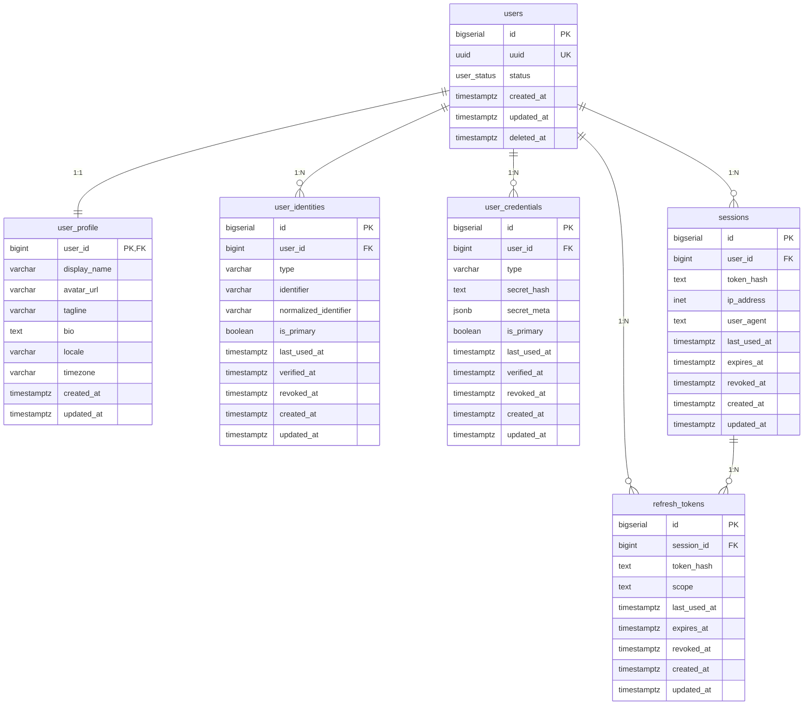

```mermaid
erDiagram
    users {
        bigserial id PK
        uuid uuid UK
        user_status status
        timestamptz created_at
        timestamptz updated_at
        timestamptz deleted_at
    }

    user_profile {
        bigint user_id PK,FK
        varchar display_name
        varchar avatar_url
        varchar tagline
        text bio
        varchar locale
        varchar timezone
        timestamptz created_at
        timestamptz updated_at
    }

    user_identities {
        bigserial id PK
        bigint user_id FK
        varchar type
        varchar identifier
        varchar normalized_identifier
        boolean is_primary
        timestamptz last_used_at
        timestamptz verified_at
        timestamptz revoked_at
        timestamptz created_at
        timestamptz updated_at
    }

    user_credentials {
        bigserial id PK
        bigint user_id FK
        varchar type
        text secret_hash
        jsonb secret_meta
        boolean is_primary
        timestamptz last_used_at
        timestamptz verified_at
        timestamptz revoked_at
        timestamptz created_at
        timestamptz updated_at
    }

    sessions {
        bigserial id PK
        bigint user_id FK
        text token_hash
        inet ip_address
        text user_agent
        timestamptz last_used_at
        timestamptz expires_at
        timestamptz revoked_at
        timestamptz created_at
        timestamptz updated_at
    }

    refresh_tokens {
        bigserial id PK
        bigint session_id FK
        text token_hash
        text scope
        timestamptz last_used_at
        timestamptz expires_at
        timestamptz revoked_at
        timestamptz created_at
        timestamptz updated_at
    }

    users ||--|| user_profile : "1:1"
    users ||--o{ user_identities : "1:N"
    users ||--o{ user_credentials : "1:N"
    users ||--o{ sessions : "1:N"
    users ||--o{ refresh_tokens : "1:N"
    sessions ||--o{ refresh_tokens : "1:N"
```